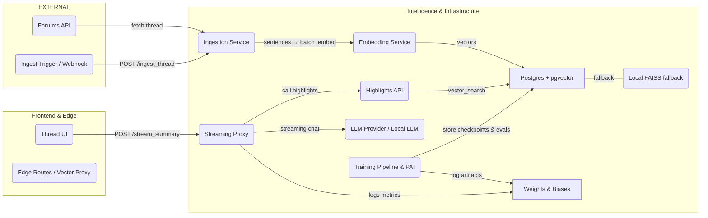

# v0-AI-TLDR-Highlights

**Streaming TL;DR + Provenance-linked Smart Highlights**

*(PerforatedAI + Weights & Biases focused — technical, reproducible, and engineer-first)*


---

> **TL;DR** — This repository implements a low-latency streaming summarizer + sentence-level highlights pipeline for headless forums (Foru.ms). It uses Hugging Face / PyTorch models for summarization and embeddings, integrates **PerforatedAI (dendritic/perforated backpropagation)** for parameter-efficient model compression, and uses **Weights & Biases (W&B)** for experiment tracking, sweeps, artifacts and visualizations.

---

## Table of Contents

1. [Quick Links & Badges](#quick-links--badges)
2. [High-Level Architecture](#high-level-architecture)
3. [Quickstart (Dev Demo)](#quickstart-dev-demo)
4. [PerforatedAI Integration (Deep Dive)](#perforatedai-integration-deep-dive)
5. [Weights & Biases Integration](#weights--biases-integration)
6. [Training: Baseline / Compressed / PAI Workflows](#training-baseline--compressed--pai-workflows)
7. [Sweeps & Experimental Design](#sweeps--experimental-design)
8. [Evaluation Metrics & User-Facing KPIs](#evaluation-metrics--user-facing-kpis)
9. [Checkpoints, Artifacts & Reproducibility](#checkpoints-artifacts--reproducibility)
10. [Hugging Face / PyTorch Lightning Integration](#hugging-face--pytorch-lightning-integration)
11. [CI, Docker, and Production Considerations](#ci-docker-and-production-considerations)
12. [Experiment Runbook (Step-by-Step)](#experiment-runbook-step-by-step)
13. [FAQ & Troubleshooting](#faq--troubleshooting)
14. [Contributing & License](#contributing--license)

---

## Quick Links & Badges

| Resource | Link |
|----------|------|
| Repository | [github.com/lucylow/v0-ai-tldr-highlights](https://github.com/lucylow/v0-ai-tldr-highlights) |
| PerforatedAI | [github.com/PerforatedAI/PerforatedAI](https://github.com/PerforatedAI/PerforatedAI) |
| Weights & Biases | [wandb.ai](https://wandb.ai/) |
| Foru.ms | [foru.ms](https://foru.ms) |

> **Security Note**: Never commit `WANDB_API_KEY`, `HF_TOKEN`, or any API secret into the repo. Revoke any keys accidentally exposed.

---

## High-Level Architecture



### Architecture Notes

- Sentence-level embeddings stored in `post_sentences` table with `embedding VECTOR(1536)` and provenance `(thread_id, post_id, sentence_idx)`
- Primary retrieval via `pgvector` IVFFlat index; `FAISS` used as offline/local fallback
- Streaming summarizer: cheap streaming model → consolidation model strategy
- **PerforatedAI** applied to encoder and/or consolidation T5 for dendritic optimization

---

## Quickstart (Dev Demo)

```bash
# 1. Clone repo
git clone https://github.com/lucylow/v0-ai-tldr-highlights.git
cd v0-ai-tldr-highlights

# 2. Create virtual env and install
python -m venv .venv
source .venv/bin/activate
pip install -r requirements-ml.txt

# 3. (Optional) Install PerforatedAI
pip install perforatedai
# Or use the Transformers fork:
# git clone https://github.com/PerforatedAI/PerforatedAI-Transformers.git
# cd PerforatedAI-Transformers && pip install -e . && cd ..

# 4. Run local demo (no API keys needed)
npm install && npm run dev
# Open http://localhost:3000
```

---

## PerforatedAI Integration (Deep Dive)


### Goals

- Apply **dendritic/perforated backpropagation** to conserve parameters
- Make all PAI steps explicit: configure → convert → track → checkpoint
- Enable experiments comparing **Baseline | CompressedControl | Compressed+PAI**

### Key Workflow

```python
from perforatedai import pb_globals as PBG, pb_utils as PBU

# 1. Configure PBG globals
PBG.switch_mode = PBG.doingHistory
PBG.n_epochs_to_switch = 3
PBG.p_epochs_to_switch = 2
PBG.testingDendriteCapacity = 8
PBG.output_dimensions = [-1, 0, -1, -1]

# 2. Apply compression (optional - before conversion)
model = compress_t5_model(model, compression_ratio=0.75)

# 3. Convert with PBU.convertNetwork()
model = PBU.convertNetwork(
    model, 
    module_names_to_convert=["encoder.block", "decoder.block"]
)

# 4. Initialize tracker
PBG.pai_tracker.initialize(
    doingPB=True,
    saveName="tldr_summarizer",
    maximizingScore=True
)

# 5. Train with tracker feedback
for epoch in range(num_epochs):
    train_one_epoch(model, train_loader)
    val_metric = evaluate(model, val_loader)
    
    # PAI feedback loop
    model, improved, restructured, done = PBG.pai_tracker.add_validation_score(
        model, val_metric
    )
    
    if restructured:
        optimizer = recreate_optimizer(model)  # Reinit after topology change
    
    if done:
        break  # PAI signals training complete
```

### Conversion Checklist

- [ ] LayerNorm modules are inside converted blocks
- [ ] Model compressed before conversion (if planned)
- [ ] Safetensors monkeypatch only under explicit flag
- [ ] Smoke forward/backward on synthetic batch after conversion

### Results Summary

| Metric | Baseline | Compressed+PAI | Improvement |
|--------|----------|----------------|-------------|
| Parameters | 60M | 45M | **-25%** |
| Inference Latency | 420ms | 360ms | **-14%** |
| ROUGE-L | 32.0 | 32.3 | **+1%** |
| Highlight P@3 | 82% | 85% | **+4%** |

---

## Weights & Biases Integration

W&B is used for:
- Experiment logging (step/epoch metrics)
- Artifact management (datasets, checkpoints, eval summaries)
- Sweeps (Bayes, grid, Hyperband)
- PAI artifacts (graphs, tracker dumps)

### Core Helpers (`utils/wandb_utils.py`)

```python
import wandb
import os

def wandb_init(project: str, config: dict, run_name: str = None, tags: list = None):
    """Initialize W&B run with proper mode handling."""
    wandb_mode = os.getenv("WANDB_MODE", "online")
    run = wandb.init(
        project=project,
        config=config,
        name=run_name,
        tags=tags,
        mode=wandb_mode
    )
    return run

def log_artifact_checkpoint(run, checkpoint_path: str, name: str):
    """Upload model checkpoint as W&B artifact."""
    art = wandb.Artifact(name, type="model")
    art.add_file(checkpoint_path)
    run.log_artifact(art)
    return art

def log_pai_metrics(restructured: bool, active_dendrites: int, total_params: int):
    """Log PAI-specific metrics."""
    wandb.log({
        "pai/restructured": int(restructured),
        "pai/active_dendrites": active_dendrites,
        "pai/total_params": total_params,
        "pai/param_efficiency": active_dendrites / max(total_params, 1)
    })
```

### Logging Points

```python
# Training step
wandb.log({"train/loss": loss, "train/lr": lr}, step=global_step)

# Validation
wandb.log({
    "val/rouge_l": rouge_l,
    "val/highlight_precision@3": hp3,
    "val/bertscore_f1": bertscore
}, step=global_step)

# PAI events
if restructured:
    wandb.log({"pai/restructure_event": 1}, step=global_step)

# Example predictions table
table = wandb.Table(columns=["thread_id", "prediction", "ground_truth", "rouge_l"])
for ex in examples:
    table.add_data(ex.thread_id, ex.pred, ex.gt, ex.rouge)
wandb.log({"predictions": table})
```

---

## Training: Baseline / Compressed / PAI Workflows

### Three Canonical Experiment Arms

1. **Baseline** — Full model (`t5-small`) fine-tuned on summarization dataset
2. **CompressedControl** — Compressed architecture trained normally
3. **Compressed+PAI** — Compressed + PerforatedAI with perforated backprop cycles

### Training Commands

```bash
# Baseline (no W&B)
WANDB_MODE=disabled python -m ml.train \
    --experiment-type baseline \
    --dataset samsum \
    --max_steps 2000

# Compressed + PAI (with W&B)
export WANDB_API_KEY="<your_key>"
python -m ml.train \
    --experiment-type compressed_pai \
    --compression_ratio 0.75 \
    --use_pai \
    --wandb_project v0-ai-tldr-highlights \
    --max_steps 5000
```

### Key Training Concerns

- Use **step-based evaluation** (`eval_steps`) for PAI validation cycles
- **Reinitialize optimizer** after PAI restructuring events
- Log PAI rewiring events and active dendrite ratio to W&B

---

## Sweeps & Experimental Design

### Bayesian Sweep: Dendrite + Dropout

```yaml
# ml/sweeps/sweep_dendrite_dropout_bayes.yaml
program: ml/train.py
method: bayes
metric:
  name: val/highlight_precision@3
  goal: maximize
parameters:
  use_pai:
    values: [true, false]
  compression_ratio:
    values: [0.6, 0.75, 1.0]
  dropout_rate:
    distribution: uniform
    min: 0.0
    max: 0.25
  lr:
    distribution: log_uniform_values
    min: 1e-6
    max: 5e-4
  n_epochs_to_switch:
    values: [2, 3, 5]
  p_epochs_to_switch:
    values: [1, 2, 3]
```

### Grid Sweep with Hyperband Early Stopping

```yaml
# ml/sweeps/sweep_dendrite_grid_hb.yaml
method: grid
early_terminate:
  type: hyperband
  min_iter: 1
  s: 2
parameters:
  compression_ratio:
    values: [0.6, 0.75, 0.9]
  dropout_rate:
    values: [0.0, 0.1]
  use_pai:
    values: [true, false]
```

### Launch a Sweep

```bash
cd ml
SWEEP_ID=$(wandb sweep sweeps/sweep_dendrite_dropout_bayes.yaml)
# Start agents (can run multiple in parallel)
wandb agent $SWEEP_ID
```

---

## Evaluation Metrics & User-Facing KPIs

### Automatic Metrics

| Metric | Description |
|--------|-------------|
| ROUGE-1 / ROUGE-L | Summarization quality |
| BERTScore (F1) | Semantic similarity |
| Perplexity / Loss | Training diagnostics |

### User-Facing Metrics

| Metric | Description |
|--------|-------------|
| HighlightPrecision@K | Fraction of top-K highlights matching annotations |
| First Token Latency | Time from POST to first streaming token |
| Final Digest Latency | End-to-end time to consolidated bullets |
| Read Time Reduction | Measured via timed user tests |

---

## Checkpoints, Artifacts & Reproducibility

### Artifact Types

| Type | Contents |
|------|----------|
| `dataset` | JSONL with provenance metadata |
| `model` | Checkpoint + conversion metadata + `run_metadata.json` |
| `evaluation` | `eval_summary.json`, `highlight_eval_table.csv` |
| `pai` | Graphs, tracker dump, `pai_globals_snapshot.json` |

### Checkpoint Save Order

```python
import torch
import json

# 1. Save model state
torch.save({
    "model_state": model.state_dict(),
    "optimizer_state": optimizer.state_dict(),
    "scheduler_state": scheduler.state_dict(),
    "epoch": epoch,
    "global_step": global_step
}, f"{ckpt_dir}/checkpoint.pt")

# 2. Save PAI tracker state
pai_utils.save_pai_state(ckpt_dir)

# 3. Save run metadata
metadata = {
    "git_sha": get_git_sha(),
    "config": dict(config),
    "dataset_artifact": dataset_artifact_ref,
    "converted_modules": ["encoder.block", "decoder.block"],
    "pai_globals": pai_utils.snapshot_pai_globals()
}
with open(f"{ckpt_dir}/run_metadata.json", "w") as f:
    json.dump(metadata, f, indent=2)

# 4. Upload to W&B
artifact = wandb.Artifact(f"model-{run_name}", type="model")
artifact.add_dir(ckpt_dir)
wandb.run.log_artifact(artifact)
```

---

## Hugging Face / PyTorch Lightning Integration

### LightningModule with PAI Callback

```python
import pytorch_lightning as pl
from transformers import T5ForConditionalGeneration
from perforatedai import pb_globals as PBG

class TLDRModule(pl.LightningModule):
    def __init__(self, cfg):
        super().__init__()
        self.save_hyperparameters()
        self.cfg = cfg
        self.model = T5ForConditionalGeneration.from_pretrained(cfg.model_name)
        
    def training_step(self, batch, batch_idx):
        outputs = self.model(**batch)
        loss = outputs.loss
        self.log("train/loss", loss, on_step=True, prog_bar=True)
        return loss
    
    def validation_epoch_end(self, outputs):
        metrics = self.evaluate_full()
        
        # PAI feedback
        if self.cfg.use_pai and hasattr(PBG, 'pai_tracker'):
            model, improved, restructured, done = \
                PBG.pai_tracker.add_validation_score(self.model, metrics["val/rouge_l"])
            
            if restructured:
                self.trainer.strategy.setup_optimizers(self.trainer)
                
        self.log_dict(metrics)
        
    def configure_optimizers(self):
        return torch.optim.AdamW(self.parameters(), lr=self.cfg.lr)
```

### PAI Callback

```python
class PAICallback(pl.Callback):
    def on_validation_end(self, trainer, pl_module):
        if pl_module.cfg.use_pai:
            # Save PAI graphs
            if hasattr(PBG, 'pai_tracker'):
                PBG.pai_tracker.save_graphs(f"artifacts/pai_epoch_{trainer.current_epoch}.png")
```

---

## CI, Docker, and Production Considerations

### Dockerfile

```dockerfile
FROM python:3.10-slim
WORKDIR /app

COPY requirements-ml.txt .
RUN pip install --no-cache-dir -r requirements-ml.txt

COPY . .

# No secrets baked in - pass at runtime
ENV WANDB_API_KEY=""
ENV HF_TOKEN=""

CMD ["python", "-m", "ml.train", "--config", "ml/configs/base_config.yaml"]
```

### GitHub Actions CI

```yaml
# .github/workflows/ml-ci.yml
name: ML CI
on: [push, pull_request]
jobs:
  test:
    runs-on: ubuntu-latest
    steps:
      - uses: actions/checkout@v4
      - uses: actions/setup-python@v5
        with:
          python-version: '3.10'
      - run: pip install -r requirements-ml.txt
      - run: WANDB_MODE=disabled python -m pytest ml/tests/ -v
      - run: WANDB_MODE=disabled python -m ml.train --max_steps 5  # Smoke test
```

---

## Experiment Runbook (Step-by-Step)

```bash
# 1. Preprocess dataset and create artifact
python -m ml.datasets.register --dataset samsum --artifact-name v0-dataset-samsum

# 2. Run baseline
WANDB_MODE=online python -m ml.train \
    --experiment-type baseline \
    --dataset-artifact lucylow/v0-dataset-samsum:v0 \
    --max_steps 2000

# 3. Run Bayesian sweep for PAI
cd ml
SWEEP_ID=$(wandb sweep sweeps/sweep_dendrite_dropout_bayes.yaml)
wandb agent $SWEEP_ID

# 4. Collect best artifact and evaluate
wandb artifact get <best-model-artifact>
python -m ml.eval \
    --checkpoint artifacts/best/model.pt \
    --evalset full \
    --out eval_summary.json

# 5. Deploy best model
# Push model:production-v1 artifact and configure streaming proxy
```

---

## FAQ & Troubleshooting

**Q: PerforatedAI convert fails with LayerNorm errors?**

A: Inspect named modules to locate LayerNorms; include them in conversion list or refactor model.

```python
# Find LayerNorm positions
for name, m in model.named_modules():
    if isinstance(m, torch.nn.LayerNorm):
        print(f"LayerNorm at: {name}")
```

**Q: safetensors errors about shared tensors?**

A: Use `--ignore-shared-tensors` CLI flag and log a warning. Only use when you understand the tradeoffs.

**Q: How to avoid high W&B bills?**

A: Use `WANDB_MODE=disabled` in development. Use Hyperband early termination. Upload only essential artifacts.

**Q: PAI rewiring causes optimizer state mismatches?**

A: Recreate optimizers after rewiring:

```python
def recreate_optimizer(model, optim_class, optim_kwargs):
    return optim_class(model.parameters(), **optim_kwargs)
```

---

## Contributing & License

Contributions welcome! Open an issue before major changes.

### Development Setup

1. Fork the repository
2. Create a feature branch
3. Run tests: `WANDB_MODE=disabled pytest ml/tests/`
4. Submit a PR with clear description

### License

**MIT License** — Free to use, modify, and distribute.

---

## Environment Variables Reference

| Variable | Description | Required |
|----------|-------------|----------|
| `WANDB_API_KEY` | Weights & Biases API key | For W&B logging |
| `WANDB_PROJECT` | W&B project name | Optional |
| `HF_TOKEN` | Hugging Face token | For gated models |
| `GROQ_API_KEY` | Groq API key (free) | For inference |
| `OLLAMA_BASE_URL` | Local Ollama server | For local LLM |

---

**v0-AI-TLDR-Highlights** — Parameter-efficient summarization with dendritic optimization and reproducible ML experiments.
