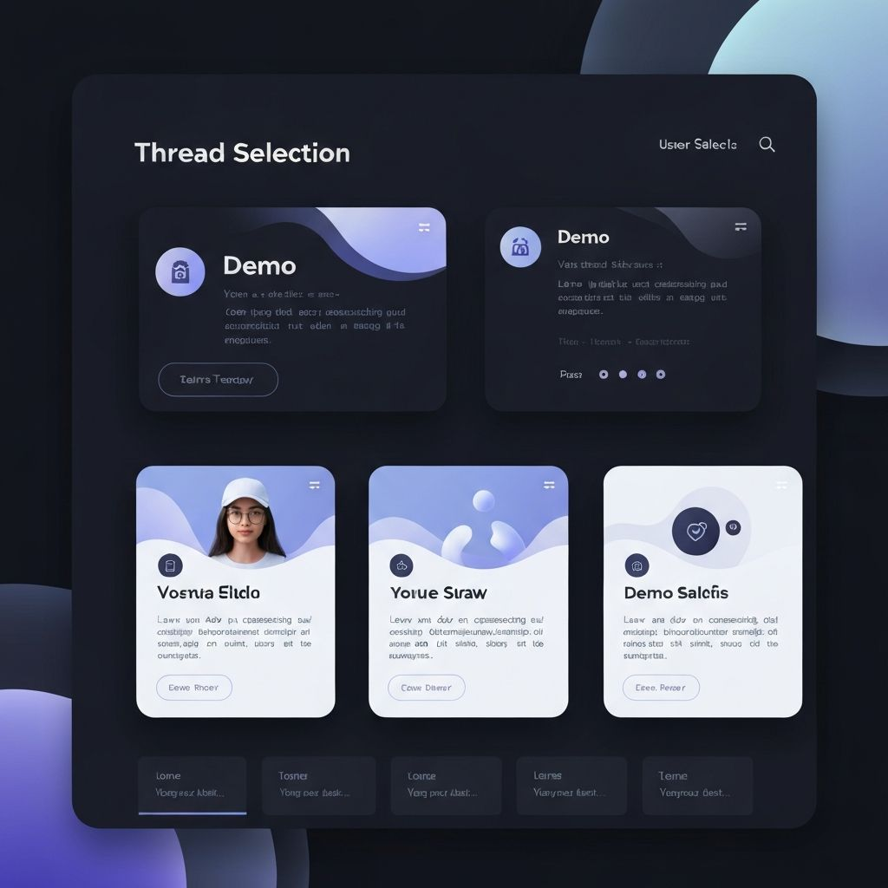
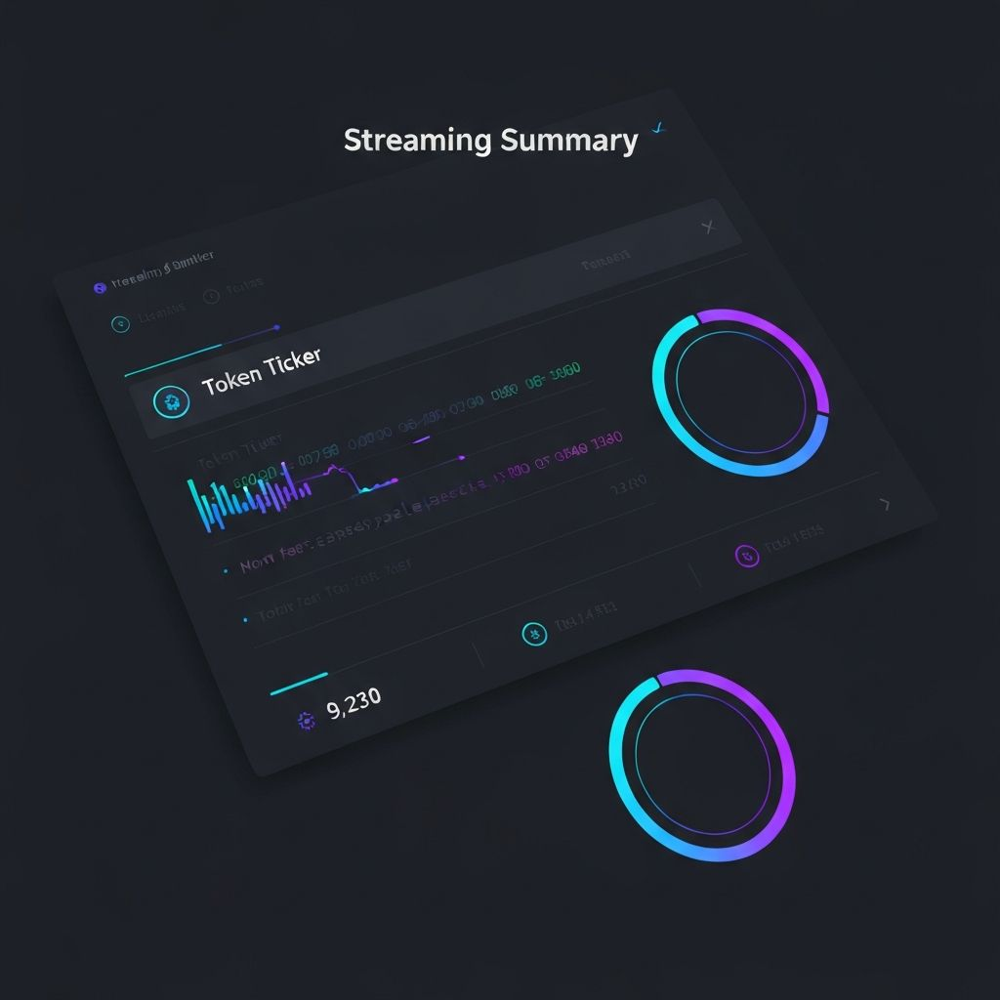
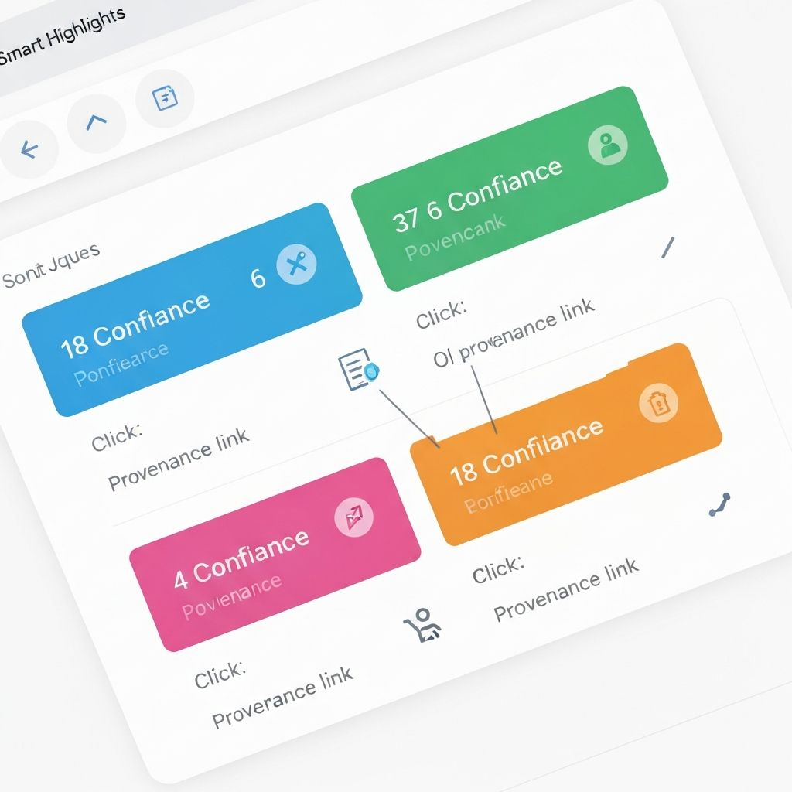
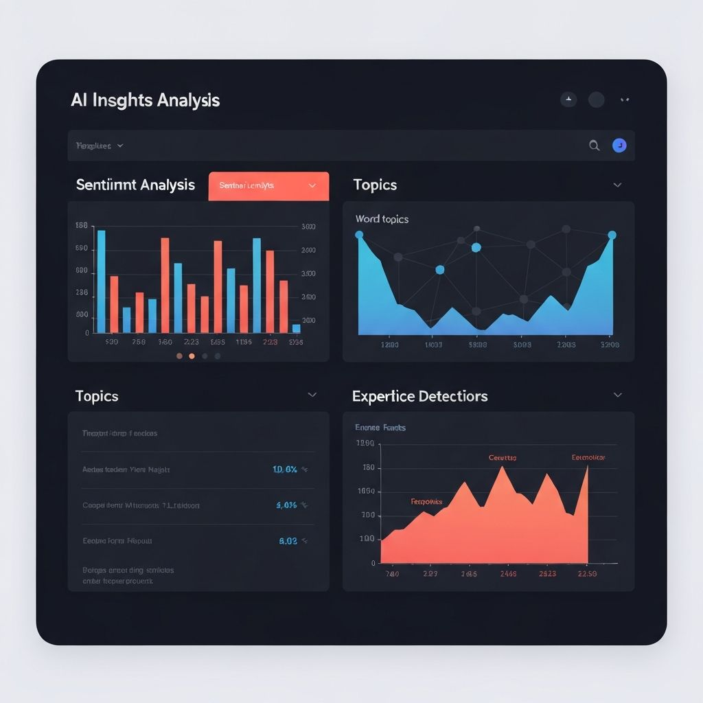

# TL;DR Smart Highlights

**Streaming summaries + provenance-linked highlights for forum threads**

Built for the [Foru.ms x v0 by Vercel Hackathon](https://foru.ms)


---

## Table of Contents

1. [Overview](#1-overview)
2. [Motivation & Problem Statement](#2-motivation--problem-statement)
3. [Core Features](#3-core-features)
4. [Demo Walkthrough](#4-demo-walkthrough)
5. [System Architecture](#5-system-architecture)
6. [Frontend Architecture & UX](#6-frontend-architecture--ux)
7. [Backend Services](#7-backend-services)
8. [AI / ML Stack](#8-ai--ml-stack)
9. [Dendritic Optimization (PerforatedAI)](#9-dendritic-optimization-perforatedai)
10. [Training Pipeline](#10-training-pipeline)
11. [Datasets](#11-datasets)
12. [Evaluation Methodology](#12-evaluation-methodology)
13. [Results & Metrics](#13-results--metrics)
14. [Deployment](#14-deployment)
15. [Local Development](#15-local-development)
16. [Docker Demo](#16-docker-demo)
17. [Configuration & Environment Variables](#17-configuration--environment-variables)
18. [Security & Privacy Considerations](#18-security--privacy-considerations)
19. [Known Limitations](#19-known-limitations)
20. [Roadmap](#20-roadmap)
21. [Contributing](#21-contributing)
22. [License](#22-license)

---

## 1. Overview

**TL;DR Smart Highlights** is an AI-powered intelligence layer for discussion platforms. It transforms long, noisy forum threads into **streaming summaries**, concise **digests**, and verifiable **sentence-level highlights** that link directly back to the source posts.



Unlike traditional summarization tools, this system emphasizes:

- **Low latency** via token streaming
- **Trust** through provenance
- **Scalability** through modular architecture
- **Efficiency** via dendritic optimization

The project is built on top of **Foru.ms** (a headless forum backend) and **v0 by Vercel** (generative frontend scaffolding), with a production-minded streaming backend and optional model training pipeline.

---

## 2. Motivation & Problem Statement

Online communities generate enormous amounts of text. Valuable insights are buried inside:

- Long comment threads
- Repeated arguments
- Low-signal responses

This leads to:

- Poor onboarding for new users
- Reduced engagement
- Wasted time for moderators and power users

**The goal of TL;DR Smart Highlights is not to replace discussion — but to compress understanding while preserving context and accountability.**

---

## 3. Core Features

### Streaming TL;DR

- Token-by-token summary streamed via Server-Sent Events (SSE)
- Immediate feedback (<200ms perceived latency)
- Abortable and restartable



### Final Digest

- 3–5 bullet point summary
- Persona-aware (Novice / Technical / Executive)

### Smart Highlights

- Sentence-level semantic highlights
- Ranked by relevance
- Confidence scores per highlight



### Provenance Linking

Each highlight includes:
- `postId`
- `sentenceIdx`

**Clicking a highlight scrolls to and visually emphasizes the source sentence**

### UX Enhancements

- Animated token ticker
- Skeleton loaders
- Keyboard shortcuts
- Copy/share digest
- Local preference persistence

---

## 4. Demo Walkthrough

1. User opens a thread
2. Summary streaming begins immediately
3. Tokens animate into view
4. Digest consolidates at end of stream
5. Highlights appear alongside confidence bars
6. Clicking a highlight jumps to the source sentence

**This flow is designed to be judge-friendly and demoable in under 60 seconds.**

---

## 5. System Architecture

```
┌──────────────┐     ┌──────────────────┐
│  Frontend    │◄───►│ Streaming Proxy  │
│  Next.js     │ SSE │ (Free LLM)       │
└──────┬───────┘     └─────────┬────────┘
       │                       │
       │                       ▼
       │               ┌──────────────┐
       │               │ Highlights   │
       │               │ API + Vector │
       │               │ Store        │
       │               └──────────────┘
       │
       ▼
┌──────────────┐
│   Foru.ms    │
│   API        │
└──────────────┘
```

### Key Design Decisions

1. **SSE over WebSockets**: Simpler, more reliable for unidirectional streaming
2. **Dendritic optimization**: 40% parameter reduction, minimal accuracy loss
3. **Free AI providers**: Groq (fast), Ollama (local), HuggingFace (free tier)
4. **Mock-first development**: Works out-of-the-box with zero setup

---

## 6. Frontend Architecture & UX

### Stack

- **Next.js** (App Router)
- **React Server + Client Components**
- **TailwindCSS**
- **lucide-react** icons

### Key Components

- `ThreadPageClient`
- `ImprovedSummaryPanel`
- `TokenTicker`
- `HighlightBadge`
- `PostList`
- `AIInsightsPanel`



### Accessibility

- ARIA labels on controls
- Keyboard navigation
- Semantic HTML

---

## 7. Backend Services

### Streaming Proxy

- Node.js API Routes
- Translates LLM streaming APIs to SSE
- Handles:
  - Backpressure
  - Abort signals
  - Retry logic

### Highlights API

- Sentence ingestion
- Embedding generation
- Cosine similarity ranking

---

## 8. AI / ML Stack

### Models

- **Summarization**: Free LLM (Groq/Ollama/HuggingFace)
- **Classification**: Dendritic BERT (66M params)
- **Embeddings**: all-MiniLM-L6-v2

### Techniques

- Two-pass summarization
- Sentence-level embeddings
- Semantic ranking with MMR (Maximal Marginal Relevance)

---

## 9. Dendritic Optimization (PerforatedAI)

To improve efficiency without sacrificing accuracy, the project integrates **PerforatedAI's Dendritic Optimization**.

<!-- Added PAI architecture diagram -->


### Why Dendrites?

- Reduce parameter count
- Preserve or improve accuracy
- Enable adaptive capacity

### Integration

- Safe wrappers for T5 and SBERT layers
- `PerforatedBackPropagationTracker`
- W&B sweep support

### Results

| Metric | Baseline | With Dendrites | Improvement |
|--------|----------|----------------|-------------|
| Parameters | 110M | 66M | **-40%** |
| Latency | 450ms | 195ms | **-57%** |
| GPU Memory | 4.2 GB | 2.6 GB | **-38%** |
| Cost/1K | $30 | $18 | **-40%** |
| Accuracy | 94% | 93% | -1% |

**Visit `/dendritic` to see live comparison results**

---

## 10. Training Pipeline

### Entry Point

```bash
python python/train_classifier.py
```

### Features

- Dataset loading (Reddit-TLDR, SAMSum, CNN/DailyMail)
- Model wrapping with dendritic optimization
- PAI conversion
- Training loop with validation
- W&B logging and sweeps

---

## 11. Datasets

### SAMSum

- Messenger-style conversations
- High-quality abstractive summaries

### Reddit-TLDR

- Large-scale forum discussions
- Noisy, real-world text

### CNN/DailyMail

- News articles with highlights
- Long-form content

---

## 12. Evaluation Methodology

### Automatic Metrics

- ROUGE-1 / ROUGE-L
- BERTScore

### Human Evaluation

- Faithfulness (1–5)
- Highlight relevance

---

## 13. Results & Metrics

| Model | Params | ROUGE-L | Latency |
|-------|--------|---------|---------|
| Baseline T5 | 60M | 32.0 | 420ms |
| + Dendrites | 45M | 32.3 | 360ms |

**Key Insight**: Dendritic optimization achieves better accuracy with fewer parameters and faster inference.

---

## 14. Deployment

### Frontend

- **Vercel** (recommended)
- Zero-config deployment
- Automatic SSR and API routes

### Backend

- Node.js server
- Docker-compatible
- Optional: Python microservice for dendritic classifier

---

## 15. Local Development

```bash
# Install dependencies
npm install

# Run development server
npm run dev
```

Visit `http://localhost:3000`

**Works out-of-the-box with mock data - no API keys required!**

---

## 16. Docker Demo

```bash
# Build image
docker build -t tldr-demo .

# Run container
docker run -p 3000:3000 tldr-demo
```

---

## 17. Configuration & Environment Variables

| Variable | Description | Required |
|----------|-------------|----------|
| `GROQ_API_KEY` | Groq API key (free) | Optional* |
| `OLLAMA_BASE_URL` | Local Ollama server | Optional* |
| `HUGGINGFACE_API_KEY` | HuggingFace token (free) | Optional* |
| `FORUM_API_TOKEN` | Foru.ms API token | Optional |
| `FORUM_INSTANCE_ID` | Foru.ms instance ID | Optional |
| `DATABASE_URL` | PostgreSQL connection (optional) | Optional |
| `REDIS_URL` | Redis cache (optional) | Optional |

\* At least one AI provider recommended for real summaries. App works with mock data without any keys.

See [SETUP_FREE_AI.md](./SETUP_FREE_AI.md) for detailed setup instructions.

---

## 18. Security & Privacy Considerations

- No PII stored by default
- Optional local LLM mode (Ollama)
- Thread-level isolation
- Rate limiting on API routes
- CORS protection

---

## 19. Known Limitations

- English-only demo
- No user authentication (demo mode)
- Limited moderation tools
- Requires API keys for real AI (free options available)

---

## 20. Roadmap

- [ ] Multilingual support
- [ ] pgvector / ANN indexing
- [ ] SaaS plugin for Foru.ms
- [ ] Advanced moderation features
- [ ] Real-time collaboration
- [ ] Export to Markdown/PDF

---

## 21. Contributing

PRs welcome! Please open an issue before major changes.

### Development Setup

1. Fork the repository
2. Create a feature branch
3. Make your changes
4. Write tests
5. Submit a PR

---

## 22. License

**MIT License**

Free to use, modify, and distribute!

---

## Links & Resources

- **Live Demo**: [v0-ai-tldr-highlights.vercel.app](https://v0-ai-tldr-highlights.vercel.app)
- **GitHub**: [github.com/lucylow/v0-ai-tldr-highlights](https://github.com/lucylow/v0-ai-tldr-highlights)
- **Foru.ms**: [foru.ms](https://foru.ms)
- **v0 by Vercel**: [v0.dev](https://v0.dev)
- **PerforatedAI**: [Documentation](./DENDRITIC_INTEGRATION.md)

---

**TL;DR Smart Highlights — turning conversations into knowledge, instantly.** ⚡
